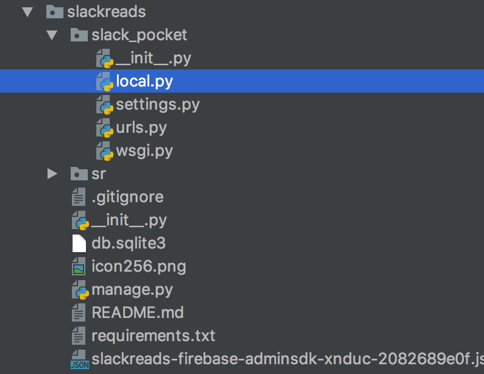
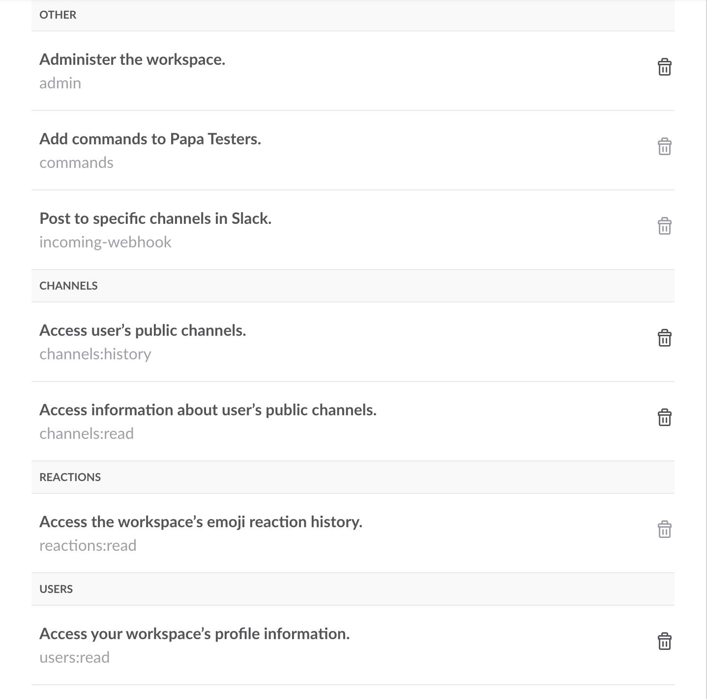
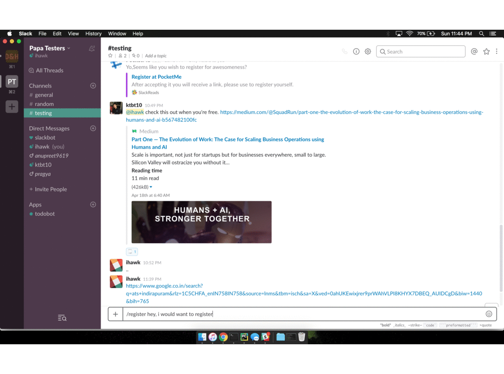

<p align="center">

<p align="center">Save shared links on slack to Pocket</p>
</p>

## Features:
Save links shared with you to your Pocket reading list with just a single reaction on the message.


## Installation
* Clone the repo.
* Create Slack App and Pocket App.
* Create '/slack_pocket/local.py' :

```py
Slack_Token = 'your_slack_token'
Consumer_Key = 'your_pocket_key'
Server_Url = 'http://your_server_url'
```


* Setting up Slack App:
1. Create a Slack App, give desired oAuth permissions and store the API key somewhere safe.
2. Create a Slash Command and add Request URL: 'yourserver/register'
3. Enable Event subscription and set Request URL: 'yourserver/event'.
4. For verifying Event URL, change view of '/event' url in your app to 'hit()' and verify. Change back to view 'event()' once verified.
5. In Event Subscription, Add Workspace Event -> 'reaction_added'
6. Update app scopes in 'oAuth & Permissions'. Make sure the following listed scopes are authorised:

7. Install App to slack.

* Setting up Database
I've used Firebase Realtime DB. For setting it up:
1. Create an App in Firebase Console.
2. Download Admin SDK and save it the root of dir.
3. Change initializing configs:
```py
cred = credentials.Certificate('admin_sdk.json')
firebase_admin.initialize_app(cred, {
    'databaseURL': 'https://your_app.firebaseio.com'
})
```

## Usage
1. Install PocketMe to your Team.
2. "/register" :
* Use this slash command to register to PocketMe.
* You will be given a URL on which you can click and authorize into your Pocket Account
* Registration done :grin:
3. Saving links using reaction:
**:spiral_note_pad:" is the only reaction that is compatible at present.**

Just react with :spiral_note_pad: emoticon on the message and it will save the link to your Pocket, if you are registered.



